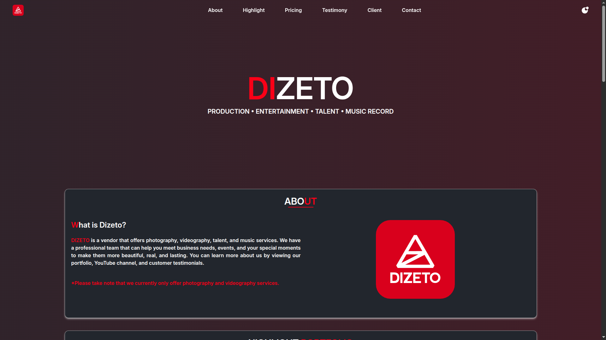
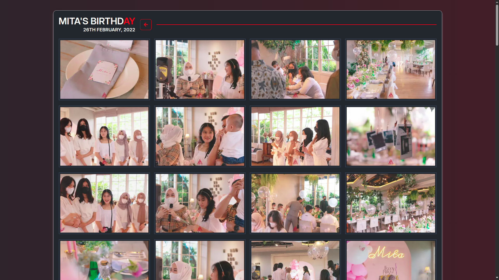

# Next.js Boilerplate Documentation

Boilerplate By [Gede Dewo Wahyu M.W](https://github.com/gdwmw) ❤️

## Boilerplate Description 📖

This boilerplate is a web application built using Next.js, which is a React framework for web application development. The boilerplate includes various features such as authentication, theme management, state management, form validation, and more. Additionally, this boilerplate follows the principles of Atomic Design for organizing components.

## Boilerplate Structure 📂

Below is the main directory structure of the boilerplate:

```
└── 📁configs
    └── 📁authentication
└── 📁docs
└── 📁src
    └── 📁app
        └── 📁(authed)
            └── 📁(admin)
            └── 📁(user)
        └── 📁(example)
            └── 📁admin-example
            └── 📁home-example
            └── 📁user-example
        └── 📁api
            └── 📁auth
                └── 📁[...nextauth]
        └── 📁authentication
            └── 📁login
            └── 📁register
        └── 📁denied
        └── 📁fonts
    └── 📁components
        └── 📁elements
        └── 📁templates
        └── index.ts
        └── README.md
    └── 📁context
    └── 📁hooks
        └── 📁cookies
        └── 📁functions
        └── 📁session
        └── index.ts
    └── 📁layouts
        └── 📁authentication
        └── 📁example
            └── 📁global
            └── 📁pages
            └── 📁template
            └── 📁modules
                └── 📁aside
                └── 📁footer
                └── 📁header
                └── 📁main
                └── 📁nav
            └── index.tsx
        └── 📁home
        └── 📁password
        └── 📁profile
    └── 📁libs
        └── 📁constants
        └── 📁providers
            └── 📁next-auth
            └── 📁next-themes
            └── 📁react-query
            └── index.ts
        └── 📁tailwind-merge
        └── index.ts
    └── 📁schemas
        └── 📁authentication
        └── 📁example
        └── 📁password
        └── 📁profile
        └── index.ts
    └── 📁styles
    └── 📁types
        └── 📁api
        └── 📁components
        └── 📁context
        └── index.ts
        └── next-auth.d.ts
    └── 📁utils
        └── 📁api
            └── 📁authentication
            └── 📁base
            └── 📁data
            └── 📁example
            └── 📁password
            └── 📁upload
            └── 📁user
            └── index.ts
        └── index.ts
    └── middleware.ts
```

### Structure Explanation 📚

- **/configs**: Contains configuration files, including authentication settings and logic.
- **/docs**: Contains project documentation such as architectural diagrams, flowcharts, API documentation, and other technical documentation that helps understand the project structure and functionality.
- **/public**: Contains static assets such as images, animations, and other static files.
- **/src/app**: Contains the main application pages, including login, admin, user, and others.
- **/src/components**: Contains reusable components throughout the application, organized following the principles of Atomic Design.
- **/src/context**: Contains context providers for state management and sharing data across components.
- **/src/hooks**: Contains custom hooks for managing state and side effects in functional components.
- **/src/layouts**: Contains layouts for various parts of the application, such as header, footer, aside, and others. The layouts are organized following the principles of Atomic Design, with components broken down into smaller, reusable pieces.
- **/src/libs**: Contains libraries such as providers for authentication and theme management, as well as constants and others.
- **/src/schemas**: Contains validation schemas using Zod to ensure incoming data meets expectations.
- **/src/styles**: Contains global styles, CSS modules, and other styling-related files.
- **/src/types**: Contains TypeScript type definitions to ensure type safety throughout the application.
- **/src/utils**: Contains utility functions used in various places within the application.
- **/src/middleware.ts**: Contains middleware functions for handling requests and responses.

## Installation 🚀

To get started with this boilerplate, follow these steps:

1. **Clone the Repository**

   ```bash
   git clone https://github.com/gdwmw/Next.js-Boilerplate.git
   cd Next.js-Boilerplate
   ```

2. **Install Dependencies**

   ```bash
   bun install
   ```

3. **Setup Environment Variables**

   ```bash
   bun cpenv
   ```

4. **Fill in the `NEXTAUTH_URL` with Local URL**

   ```bash
   http://localhost:3000
   ```

5. **Get Base64 Code to Fill in the `NEXTAUTH_SECRET` Variable**

   ```bash
   bun base64
   ```

6. **Run the Development Server**

   ```bash
   bun dev
   ```

7. **Access the Application**

   Open your browser and navigate to [http://localhost:3000](http://localhost:3000).

## Commit Guidelines 📝

When committing your changes using the `bun commit` command, please follow these steps:

1. **Ensure Your Changes Are Ready**  
   Before committing, make sure that your code is properly tested and follows the project's coding standards.

2. **Stage Your Changes**  
   Use the following command to stage your changes:

   ```bash
   git add .
   ```

3. **Run the Commit Command**  
   Execute the commit command:

   ```bash
   bun commit
   ```

4. **Follow the Commit Prompt**  
   After running the command, a prompt will appear. You will be asked to select the type of change you are committing (e.g., feature, bug fix, documentation). Choose the appropriate type.

5. **Provide a Scope (Optional)**  
   If applicable, specify the scope of your changes (e.g., a specific module or feature).

6. **Write a Descriptive Subject**  
   Write a short, imperative tense description of the change. Keep it concise and clear.

7. **Add a Detailed Body (Optional)**  
   If necessary, provide a longer description of the changes in the body section. This can include the motivation for the change and any relevant details.

8. **List Breaking Changes (If Any) (Optional)**  
   If your changes introduce breaking changes, list them in the designated section.

9. **Confirm Your Commit**  
   Review your commit message and confirm the commit when prompted.

By following these guidelines, you ensure that your commit messages are informative and consistent with the project's standards.

## Contribution 🤝

If you would like to contribute to this boilerplate, please follow these steps:

1. **Fork the Repository**  
   Click on the "Fork" button at the top right corner of the repository page to create your own copy.

2. **Clone Your Fork**  
   Clone your forked repository to your local machine:

   ```bash
   git clone https://github.com/your-username/Next.js-Boilerplate.git
   cd Next.js-Boilerplate
   ```

3. **Create a New Branch**  
   Create a new branch for your feature or bug fix:

   ```bash
   git checkout -b your-feature-branch
   ```

4. **Make Your Changes**  
   Implement your changes and ensure that your code follows the project's coding standards.

5. **Commit Your Changes**  
   Commit your changes with a descriptive message:

   ```bash
   bun commit
   ```

6. **Push to Your Fork**  
   Push your changes to your forked repository:

   ```bash
   git push origin your-feature-branch
   ```

7. **Create a Pull Request**  
   Go to the original repository and click on "New Pull Request". Select your branch and submit the pull request with a description of the changes you made.

Thank you for your contribution!

## MIT License ⚖️

This boilerplate is licensed under the MIT License. Please see the `LICENSE` file for more information.

## How to Ask Questions❓

If you have any questions regarding the boilerplate or its usage, please follow these guidelines:

1. **Be Clear and Concise**  
   Clearly state your question or issue. Provide enough context for others to understand your problem.

2. **Include Relevant Details**  
   Mention any specific errors, code snippets, or configurations that are relevant to your question.

3. **Search Before Asking**  
   Check the documentation and existing issues to see if your question has already been answered.

4. **Use Proper Formatting**  
   When sharing code or error messages, use code blocks for better readability.

5. **Be Respectful**  
   Remember to be polite and respectful in your communication.

By following these guidelines, you can help ensure that your questions are understood and addressed promptly.

This documentation provides a clear overview of the boilerplate, installation instructions, commit guidelines, and contribution guidelines. If you have any further questions, feel free to ask!
